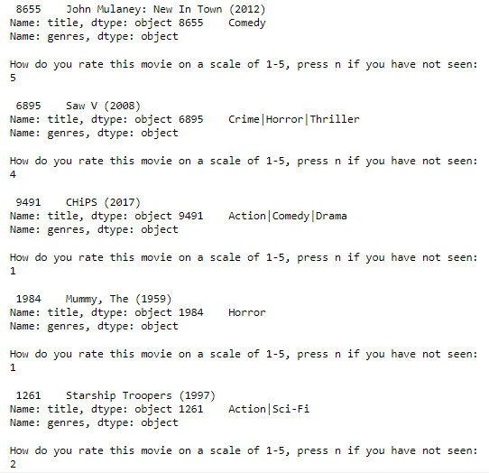
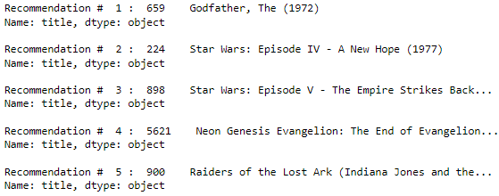

# Recommendation Systems Movie

You pick the movie, I'll choose the restaurant...

## 1. Project Overview

Choosing movies can be stressful, high-stakes endeavor for anyone. Fortunately, this program is here to help. It provides movie recommendations for any new user, based on their movie preferences. The program asks the user to rate five random movies from a database of 9,742 movies. Based on how the new user rates the five random movies, the program utilizes a user-based collaborative filtering model to provide five recommendations.

## 2. Business Case

With the vast entertainment options available, low engagement and user churn in any social media or streaming service can hurt profit. Considering that 20% of adults are indecisive and 67% of relationship agreements never get resolved, picking a movie can be a daunting task, fueling decision paralysis and disengagement. Luckily, machine learning can relieve indecision by providing recommendations for any user, based on their preferences.

## 3. Github Repository

To execute this project, a github repository is utilized for public viewing and collaboration

You can see the following files stored in the github repository.

* *data*  - Folder containg the source data files
    * [links.csv](data/links.csv)
    * [movies.csv](data/movies.csv)
    * [ratings.csv](data/ratings.csv)
    * [tags.csv](data/tags.csv)

* *Images* - Folder containing the image files used in the Notebook, Presentation, and README file

* *PDFs* - Folder containing pdf files below 
    * [Presentation](pdfs/Presentation.pdf) - Non-technical presentation of the Analysis
    * [Movie Recommendation Systems Notebook](pdfs/Notebook.pdf) - complete Jupyter Python Notebook in pdf form
            
* [README](README.md) the currently file you're reading with descriptions about the coding file

* [.gitignore](.gitignore.txt) - git ignore file 

* [Movie Recommendation Systems Notebook](movie_recommendation_system.ipynb) - Notebook with Python analysis

## 4. Data Approach

### The Data
The program gets a user to rate five random movies from an existing database, and then returns five recommendations. It utilizes an [existing database](#data), as described above, containing movie ratings (0-5) on thousands of movies from hundreds of users. The approach relies on the model's ability to predict how any user would rate any movie. The `surprise` module was used to implement this recommendation system.

The approach can be summarized as follows:

Step 1: Prior to input from the new user, we created user-based collaborative filtering prediction model to predict how an existing user would rate a movie from the database. A few different models were attempted, but a model-based, single value decompisition method was selected.
Step 2: Prompt user to rate five movies.
Step 3: Add user's rating to the existing database
Step 4: Use the model from step 1 to predict how new users movie would rate (0-5) for all movies in the database and sort highest to lowest 
Step 5: Output the top 5 recommendations 

### Source Data 
This project uses the Movielens dataset from the [GroupLens](https://grouplens.org/datasets/movielens/) lab at the University of Minnesota, which can be found in in the [`data`](#data) folder in this GitHub repository. 

The website notes that "This dataset (ml-latest-small) describes 5-star rating and free-text tagging activity from MovieLens, a movie recommendation service. It contains 100836 ratings and 3683 tag applications across 9,742 movies. These data were created by 610 users between March 29, 1996 and September 24, 2018. This dataset was generated on September 26, 2018. Users were selected at random for inclusion. All selected users had rated at least 20 movies. No demographic information is included. Each user is represented by an id, and no other information is provided."

The data are contained in the following files:

* [links.csv](data/links.csv)
* [movies.csv](data/movies.csv)
* [ratings.csv](data/ratings.csv)
* [tags.csv](data/tags.csv)

## 5. Modeling

To determine the best collaborative filtering model, multiple iterations were performed utilizing the `surprise` module's built-in capabilities. The relevant metric for evaluating the best mode was Root Mean Square Error (RMSE). Considering that the scale is (0-5), we're probably hoping for something less than 1, and maybe even within 0.5.

But first, we created two baselines models of random selections and determined the RSME for those. One will be just picking a rating (0.0-5.0) at random. The other will take a normal distribution of ratings to pick at random, assuming the mean is around 2.5.

After that, we utilized the `surpise` method to test SVD with GridSearch, KNNBasic, and KNNBaseline, with appropriate cross-validation. KNNBasic and KNNBaseline hyperparameters were tested manually, alternating between pearson/cosine similarities and user/item based similarities. 

The method with the lowest RMSE (0.859) was a user-based, SVD with tuned hyperparameters {n_factors=150, n_epochs=25, lr_all=0.010, reg_all=0.05}.

## 6. Sample Input/Output

### Some input

### Output

